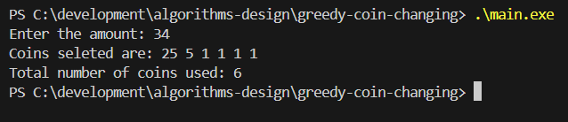

# greedy-coin-changing
Coin changing Greedy Algorithm

## 1. Overview 
The coin changing problem is a classic problem in algorithm design. The goal is to deterine how to make a specific amount of money using the smallest number of coins from a given set of coin denominations. 

The program implements the greedy apporach of the coin-changing algorithm, also know as cashier algorithm. The algorithm repeatedly selects the largest coin denomination that does not exceed the remaining amount to be paid. The process continues until the entire amount is represented using the available coins.


## 2. Problem Description 
Given a set of coin denominations and the amount to return, the objective is to determine which coins should be selected to make up the amount. 

The greedy approach works by always choosing the largest possible coin that does not exceed the remaining amount. This straegy works correctly for common coin systems such as US currency. 


## 3. Objectives 
The objective of the project are:
* implement the greedy coin changing algorithm in c++
* understand how greedy strategies work
* practice working with vectors and basic algorithm techniques
* analyze the time and space somplexity of the algorithm


## 4. Input and Output 
#### Input
The program takes a list of coin denomination (hardcoded in the program) and an integer amount entered by the user. 
###### Example:
34

#### Output
The program outputs the coins selected to form the maount and the total amount of coins used. 
###### Example:
* Coins selected are: 25, 5, 1, 1, 1, 1
* Total number of coins used: 6


## 5. Algorithm / Approach 
The program follows the greedy approach to the problem.
* sort the coin denominations in ascending order.
* while the remaining amount is not zero:
  * find the largest coin value that is less than or equal to the remaining amount
  * subtract the coin value from the remaining amount
  * add the coin to the list of selected coins 
* repeat until the remaining amount becomes zero
* return the list of selected coins
This approach ensures that at each step the largest coin is selected. 


## 6. Data Structures Used 
#### Vector (std::vector)
Vector is used to store the coin denominations and the selected coins that form the final solution. 
Vectors allow dynamic storage and easy traversal of elements. 


## 7. Time and Space Complexity 
#### Time Complexity
Sorting the coins: O(n log n) 
where n is the number of coin denominations

The loop that finds the next coin runs multiple times depending on the amount. In the worst case it scans the coin list each iteration. 

Overall complexity: O(n log n + kn)
where k is the number of coins selected.

#### Space complexity
The algorithm stores the selected coins in a vector. 
So, space cpmplexity: O(k)
where k is the nubmer of coins used in the final solution. 


## 8. How to Compile and Run 
#### Compile the program
```bash
g++ main.cpp -o main.exe
```
```bash
./main.exe
```
Then enter the amount when prompted. 


## 9. Sample Input and Output 
#### Example:
* Enter the amount: 34
* Coins selected are: 25 5 1 1 1 1
* Total number of coins used: 6
  



## 10. Constraint
The greedy algorithm does not always produce the optimal solution for every set of deominations. 
Consider the coin system: 1,3, 4
Greedy result: 4, 1, 1 (3 coins)
However, teh optimal solution is: 3, 3 (2 coins)

So in this case, the greedy algorithm does not produce the optimal result. 

Greedy algorithm only consider the best choice at the current step. They do not look ahead to see if a different choice might produce a better overall solution. 

For some coin systems like the US currency, teh greedy approach works perfectly. However, for other coin systems, a dynamic programming approach is needed to guarantee the optimal solution. 
